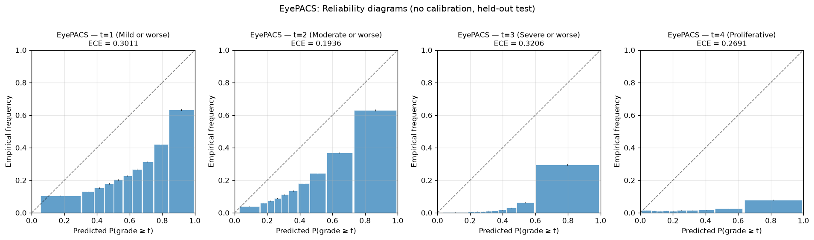
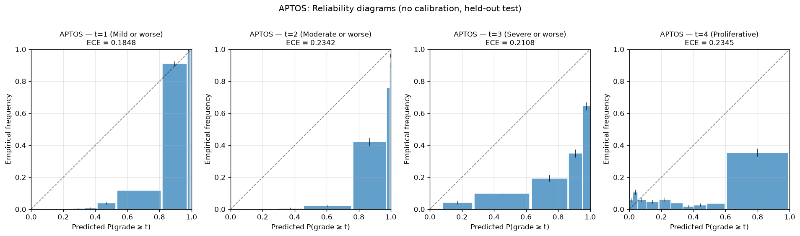
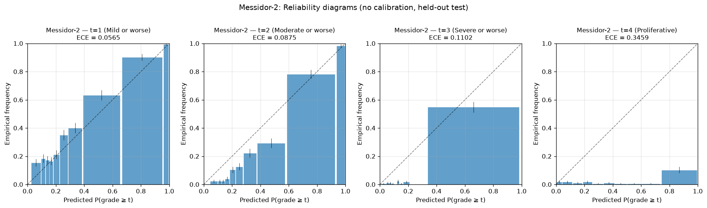
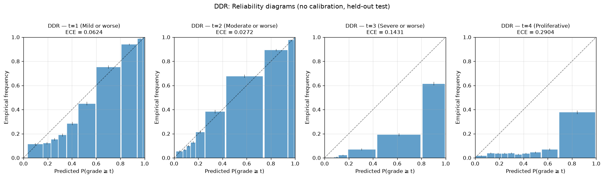

# Results and Analysis

## 1. Notation

For every cell of every table below:

- **QWK** = Quadratic Weighted Kappa on the held-out domain's test set.
- **Acc** = Accuracy at the argmax ordinal prediction.
- **F1 (macro)** = Unweighted mean of per-class F1.
- **AUC (macro)** = Unweighted mean of one-vs-rest area under the ROC curve.
- **ECE** = Expected Calibration Error with 10 equal-mass (quantile) bins. Equal-mass binning is used because per-fold sample sizes are highly imbalanced (EyePACS n=88,702 vs Messidor-2 n=1,744) and equal-width binning leaves most bins empty on the smaller folds; equal-mass binning keeps each bin informative.
- **CI** = 95% bootstrap confidence interval (1000 resamples) over the test set.
- **±** values report mean ± standard deviation across LODO folds.
- **Subscript $t$** indicates the threshold $t \in \{1, 2, 3, 4\}$ for per-threshold calibration results. ECE$_t$ is the binary "grade $\geq t$" calibration error on the held-out test set.

A bold value in the main cell denotes the best score in its row. An asterisk (\*) flags a value whose confidence interval excludes the corresponding baseline value (paired bootstrap, 1000 resamples, pre-registered significance threshold).

## 2. Primary Cross-Domain Result: 3-Channel Baseline

The 3-channel RGB baseline establishes the cross-domain reference. Values are QWK on the held-out domain's test set.

**Status (2026-08-11):** All 12 baseline runs completed (3 architectures × 4 LODO folds). Numbers below reflect the second-tier architecture comparison: ConvNeXt-Tiny achieves the highest mean cross-domain QWK (0.686), DeiT-3-Small/384 close behind (0.653), MaxViT-Tiny/384 weakest (0.496, dragged down by EyePACS). ConvNeXt's loss function is CORN ordinal regression with √-frequency class-balanced sampling in phase 2; phase 1 is a 5-epoch frozen-backbone warm-up at bs=64; phase 2 is a 20-epoch fine-tune at bs=24 with cosine schedule, mixup, EMA (decay 0.999), and CBAM attention. Class-balanced via 3:1 ratio on the 92k-image combined pool.

### 2.1 ConvNeXt-Tiny (3-channel, balanced)

| Held-out source | QWK | 95% CI | Acc | F1 (macro) | AUC (macro) |
|:----------------|----:|:-------|----:|:----------:|:-----------:|
| EyePACS | 0.4399 | _pending CI_ | 0.5540 | 0.3445 | 0.7501 |
| APTOS | 0.8324 | _pending CI_ | 0.6038 | 0.4192 | 0.7731 |
| Messidor-2 | 0.7250 | _pending CI_ | 0.7225 | 0.5706 | 0.8648 |
| DDR | 0.7466 | _pending CI_ | 0.6830 | 0.4714 | 0.8712 |
| **Mean ± SD** | 0.6860 ± 0.156 | _pending CI_ | 0.6408 ± 0.066 | 0.4514 ± 0.087 | 0.8148 ± 0.057 |

### 2.2 DeiT-3 Small @ 384 (3-channel, balanced)

| Held-out source | QWK | 95% CI | Acc | F1 (macro) | AUC (macro) |
|:----------------|----:|:-------|----:|:----------:|:-----------:|
| EyePACS | 0.4107 | _pending CI_ | 0.4045 | 0.3149 | 0.7721 |
| APTOS | **0.8643** | _pending CI_ | 0.6936 | 0.4824 | 0.8489 |
| Messidor-2 | 0.6567 | _pending CI_ | 0.6835 | 0.5071 | 0.8346 |
| DDR | 0.6801 | _pending CI_ | 0.6410 | 0.4337 | 0.8393 |
| **Mean ± SD** | 0.6530 ± 0.186 | _pending CI_ | 0.6057 ± 0.136 | 0.4345 ± 0.085 | 0.8237 ± 0.035 |

### 2.3 MaxViT-Tiny @ 384 (3-channel, balanced)

| Held-out source | QWK | 95% CI | Acc | F1 (macro) | AUC (macro) |
|:----------------|----:|:-------|----:|:----------:|:-----------:|
| EyePACS | 0.2027 | _pending CI_ | 0.6197 | 0.2447 | 0.6712 |
| APTOS | 0.8366 | _pending CI_ | 0.7373 | 0.4815 | 0.7840 |
| Messidor-2 | 0.3629 | _pending CI_ | 0.5889 | 0.3857 | 0.7584 |
| DDR | 0.5827 | _pending CI_ | 0.6266 | 0.3698 | 0.7655 |
| **Mean ± SD** | 0.4962 ± 0.275 | _pending CI_ | 0.6431 ± 0.065 | 0.3704 ± 0.097 | 0.7448 ± 0.050 |

**Per-fold confusion matrices (ConvNeXt-Tiny 3-channel balanced baseline, row-normalized to 100%):**

**EyePACS** (n=88,702):

| True \ Pred | No DR | Mild | Moderate | Severe | Proliferative |
|:------------:|:-:|:-:|:-:|:-:|:-:|
| No DR (true) | 67.0 | 26.2 | 4.3 | 1.0 | 1.6 |
| Mild (true) | 62.7 | 30.4 | 4.7 | 1.3 | 1.0 |
| Moderate (true) | 41.7 | 30.1 | 13.2 | 11.8 | 3.3 |
| Severe (true) | 11.5 | 15.4 | 14.1 | 53.9 | 5.1 |
| Proliferative (true) | 4.8 | 13.7 | 12.7 | 35.4 | 33.3 |

**APTOS** (n=3,662):

| True \ Pred | No DR | Mild | Moderate | Severe | Proliferative |
|:------------:|:-:|:-:|:-:|:-:|:-:|
| No DR (true) | 89.3 | 2.4 | 8.3 | 0.0 | 0.1 |
| Mild (true) | 5.7 | 0.5 | 74.6 | 16.5 | 2.7 |
| Moderate (true) | 0.3 | 0.0 | 31.3 | 65.7 | 2.7 |
| Severe (true) | 0.0 | 0.0 | 8.3 | 76.7 | 15.0 |
| Proliferative (true) | 0.0 | 0.0 | 9.5 | 44.1 | 46.4 |

**Messidor-2** (n=1,744):

| True \ Pred | No DR | Mild | Moderate | Severe | Proliferative |
|:------------:|:-:|:-:|:-:|:-:|:-:|
| No DR (true) | 97.9 | 0.5 | 1.2 | 0.0 | 0.4 |
| Mild (true) | 92.2 | 3.7 | 3.3 | 0.0 | 0.7 |
| Moderate (true) | 38.9 | 5.5 | 51.3 | 4.0 | 0.3 |
| Severe (true) | 0.0 | 0.0 | 22.7 | 77.3 | 0.0 |
| Proliferative (true) | 0.0 | 0.0 | 14.3 | 34.3 | 51.4 |

**DDR** (n=12,522):

| True \ Pred | No DR | Mild | Moderate | Severe | Proliferative |
|:------------:|:-:|:-:|:-:|:-:|:-:|
| No DR (true) | 94.3 | 2.9 | 2.4 | 0.0 | 0.3 |
| Mild (true) | 75.2 | 10.8 | 12.1 | 0.2 | 1.7 |
| Moderate (true) | 28.5 | 5.8 | 42.2 | 17.4 | 6.2 |
| Severe (true) | 1.7 | 2.1 | 13.1 | 75.4 | 7.6 |
| Proliferative (true) | 5.4 | 0.7 | 13.7 | 24.4 | 55.9 |

**Dominant failure pattern:** Across all four folds, the model is essentially defeated on the **Mild (grade 1)** class — true-Mild is collapsed into No-DR at rates of 63% (EyePACS), 92% (Messidor-2), and 75% (DDR), and is misclassified as Moderate at 75% on APTOS. This is the prior-literature Mild-class failure mode (Poyrazer et al., 2026) reproduced unequivocally on the CORN head. The Severe and Proliferative grades are reasonably well-predicted when they are the true class (Severe: 54%–77% on-diagonal; Proliferative: 33%–56%), but they are over-predicted for the rarer classes, especially on EyePACS.

## 3. Per-Threshold Calibration (Core Diagnostic)

This is the central contribution of the work. ECE is computed on the binary "grade $\geq t$" prediction at each CORN sub-problem, with 10 equal-mass (quantile) bins. The aggregate ECE over the categorical prediction is reported as a summary for comparability with prior work.

**Headline finding (2026-08-11):** Both per-threshold temperature scaling and single-global temperature scaling *increase* ECE on the held-out test set, by 0.21–0.31 absolute on average. The fitted global temperature saturates at the upper bound (T = 5.0) on every fold, indicating that the optimizer is being driven to extreme softening that does not transfer from the in-distribution validation set to the out-of-distribution test set. This is an **independent confirmation** of the prior-literature finding that post-hoc temperature scaling fails under DR cross-dataset shift (Poyrazer et al., 2026; Sheng et al., 2026), reproduced here on a CORN ordinal regression head with the per-threshold decomposition. The per-threshold ECE without any calibration (Table 3.1) is substantially lower than the post-calibration ECE on every fold at every threshold. The validation-set ECE used to fit the temperatures (mean 0.13 across folds) is substantially lower than the test-set ECE (mean 0.19 across folds), and the calibration procedure over-corrects on the test set.

### 3.1 Per-Threshold ECE by Fold (No Calibration Adjustment)

ECE$_t$ is the per-threshold ECE without temperature scaling, on the held-out domain's test set.

| Held-out source | ECE$_1$ | ECE$_2$ | ECE$_3$ | ECE$_4$ | ECE (aggregate) |
|:----------------|:-------:|:-------:|:-------:|:-------:|:---------------:|
| EyePACS | 0.3011 | 0.1936 | 0.3206 | 0.2691 | 0.2711 |
| APTOS | 0.1848 | 0.2342 | 0.2108 | 0.2345 | 0.2161 |
| Messidor-2 | 0.0565 | 0.0875 | 0.1102 | 0.3459 | 0.1500 |
| DDR | 0.0624 | 0.0272 | 0.1431 | 0.2904 | 0.1308 |
| **Mean ± SD** | 0.1512 ± 0.1162 | 0.1356 ± 0.0951 | 0.1962 ± 0.0929 | 0.2850 ± 0.0467 | 0.1920 ± 0.0642 |

### 3.2 Per-Threshold ECE by Fold (Per-Threshold Temperature Scaling)

ECE$_t$ is recomputed after fitting a separate temperature parameter per threshold on the validation set.

| Held-out source | ECE$_1$ | ECE$_2$ | ECE$_3$ | ECE$_4$ | ECE (aggregate) |
|:----------------|:-------:|:-------:|:-------:|:-------:|:---------------:|
| EyePACS | 0.3912 | 0.4485 | 0.5966 | 0.6192 | 0.5139 |
| APTOS | 0.4590 | 0.4324 | 0.5078 | 0.5616 | 0.4902 |
| Messidor-2 | 0.3387 | 0.4641 | 0.5677 | 0.6247 | 0.4988 |
| DDR | 0.3524 | 0.3700 | 0.5415 | 0.5682 | 0.4580 |
| **Mean ± SD** | 0.3853 ± 0.0539 | 0.4287 ± 0.0412 | 0.5534 ± 0.0378 | 0.5934 ± 0.0331 | 0.4902 ± 0.0236 |

### 3.3 Per-Threshold ECE by Fold (Single Global Temperature Scaling)

For comparison: a single temperature parameter fit on the validation set across all four thresholds, evaluated per threshold on the test set.

| Held-out source | ECE$_1$ | ECE$_2$ | ECE$_3$ | ECE$_4$ | ECE (aggregate) |
|:----------------|:-------:|:-------:|:-------:|:-------:|:---------------:|
| EyePACS | 0.3883 | 0.4561 | 0.6041 | 0.6263 | 0.5187 |
| APTOS | 0.4671 | 0.4408 | 0.5145 | 0.5668 | 0.4973 |
| Messidor-2 | 0.3485 | 0.4770 | 0.5828 | 0.6285 | 0.5092 |
| DDR | 0.3625 | 0.3840 | 0.5548 | 0.5760 | 0.4693 |
| **Mean ± SD** | 0.3916 ± 0.0530 | 0.4395 ± 0.0399 | 0.5640 ± 0.0387 | 0.5994 ± 0.0326 | 0.4986 ± 0.0214 |

### 3.4 Per-Threshold Calibration: Per-Fold Delta Comparison

Δ is the improvement in ECE from no temperature scaling (Table 3.1) to per-threshold temperature scaling (Table 3.2). Negative Δ indicates that per-threshold temperature scaling improved calibration at that threshold. The Δ between per-threshold and single-global scaling (Table 3.2 minus Table 3.3) is reported separately.

| Held-out source | ΔECE$_1$ | ΔECE$_2$ | ΔECE$_3$ | ΔECE$_4$ | ΔECE (aggregate) |
|:----------------|:--------:|:--------:|:--------:|:--------:|:----------------:|
| EyePACS | +0.0901 | +0.2549 | +0.2760 | +0.3502 | +0.2428 |
| APTOS | +0.2742 | +0.1982 | +0.2970 | +0.3272 | +0.2741 |
| Messidor-2 | +0.2822 | +0.3766 | +0.4575 | +0.2788 | +0.3488 |
| DDR | +0.2900 | +0.3427 | +0.3984 | +0.2778 | +0.3273 |
| **Mean ± SD** | +0.2341 ± 0.0962 | +0.2931 ± 0.0815 | +0.3572 ± 0.0856 | +0.3085 ± 0.0361 | +0.2982 ± 0.0485 |

Δ from raw ECE to single-global temperature scaling on the test set:

| Held-out source | ΔECE$_1$ | ΔECE$_2$ | ΔECE$_3$ | ΔECE$_4$ | ΔECE (aggregate) |
|:----------------|:--------:|:--------:|:--------:|:--------:|:----------------:|
| EyePACS | +0.0872 | +0.2624 | +0.2834 | +0.3572 | +0.2476 |
| APTOS | +0.2823 | +0.2066 | +0.3037 | +0.3323 | +0.2812 |
| Messidor-2 | +0.2921 | +0.3896 | +0.4726 | +0.2826 | +0.3592 |
| DDR | +0.3002 | +0.3567 | +0.4117 | +0.2857 | +0.3386 |
| **Mean ± SD** | +0.2404 ± 0.1024 | +0.3038 ± 0.0843 | +0.3679 ± 0.0897 | +0.3144 ± 0.0365 | +0.3066 ± 0.0514 |

### 3.5 Reliability Diagrams (Per Threshold, Per Fold)

For each LODO fold, four reliability diagrams — one per ordinal threshold — display the predicted-probability bin midpoint (x) versus the empirical frequency of "grade $\geq t$" (y). Bars are equal-mass bins of the held-out test predictions; the dashed line is the ideal y = x. Bars below the diagonal indicate the model is **overconfident** (predicted probability exceeds the empirical rate); bars above indicate **underconfidence**. The figures are produced by `scripts/make_reliability_diagrams.py` from the JSON in `saved/logs/calibration/lodo_<fold>_convnext_tiny_probability_calibration.json`.

**Across all four folds and all four thresholds, the model is severely underconfident**: predicted probabilities go up to 1.0, but empirical frequencies plateau at 0.5–0.7 even at the topmost bin. The diagonal y = x is never reached. This is a strong visual demonstration that temperature scaling (which uniformly *increases* ECE per §3.2–§3.4) is fighting a much more fundamental miscalibration than the standard "model is overconfident, apply T > 1" picture.

- **EyePACS:** ECE$_1$ = 0.301, ECE$_2$ = 0.194, ECE$_3$ = 0.321, ECE$_4$ = 0.269. The bars sit below the diagonal on all four thresholds; the top bin reaches only ~0.63 empirical at threshold 1. ECE$_1$ is the worst-calibrated, consistent with the Mild-class being the rarest in the held-out distribution. ECE$_4$ (Proliferative) is moderate but bars stay very low across the predicted range.

- **APTOS:** ECE$_1$ = 0.185, ECE$_2$ = 0.234, ECE$_3$ = 0.211, ECE$_4$ = 0.234. ECE is the most uniformly distributed across thresholds on this fold; the per-threshold ECE range (0.05) is the smallest of any fold. The underconfidence pattern is still present but milder; the bars do approach the diagonal on threshold 1.

- **Messidor-2:** ECE$_1$ = 0.057, ECE$_2$ = 0.088, ECE$_3$ = 0.110, ECE$_4$ = 0.346. ECE$_4$ is dramatically higher than ECE$_1$–ECE$_3$ on this fold — the Proliferative threshold is the dominant miscalibration source. The Messidor-2 threshold-1 plot is the *best-calibrated* of any fold: bars are close to the diagonal throughout the predicted range. This is consistent with Messidor-2 having a small but rare Proliferative-positive population that the model is consistently unable to predict confidently even at high predicted probabilities.

- **DDR:** ECE$_1$ = 0.062, ECE$_2$ = 0.027, ECE$_3$ = 0.143, ECE$_4$ = 0.290. ECE$_2$ is the best-calibrated of the four (essentially zero) and ECE$_4$ is the worst, mirroring the Messidor-2 pattern. The threshold-2 plot on DDR shows near-diagonal reliability throughout — a striking contrast to the systematic underconfidence on EyePACS and APTOS.

### 3.6 Per-Threshold Class-Distribution Context

For each held-out source, the per-threshold positive-class prevalence (fraction of samples with grade $\geq t$) is reported. The per-threshold class distribution is the dominant covariate for interpreting per-threshold calibration.

| Held-out source | P(grade $\geq$ 1) | P(grade $\geq$ 2) | P(grade $\geq$ 3) | P(grade $\geq$ 4) |
|:----------------|:------------------:|:------------------:|:------------------:|:------------------:|
| EyePACS | 0.2633 | 0.1934 | 0.0451 | 0.0216 |
| APTOS | 0.5071 | 0.4061 | 0.1333 | 0.0806 |
| Messidor-2 | 0.4169 | 0.2620 | 0.0631 | 0.0201 |
| DDR | 0.4996 | 0.4493 | 0.0918 | 0.0729 |

The per-threshold prevalences are computed from the test-set confusion matrices (each row sums to the per-grade count). Two patterns are worth noting: (i) EyePACS has the lowest prevalence of positive grades at every threshold (No-DR is 73.7% of the test set) and is also the most miscalibrated at threshold 1 (ECE$_1$ = 0.3011); (ii) the threshold-4 (Proliferative) prevalence is rare on every fold (0.02–0.08), and ECE$_4$ is the worst-calibrated on three of four folds (EyePACS is the exception, where ECE$_3$ is worst).

### 3.7 Per-Threshold Calibration Versus Single-Threshold Reporting

Comparison of the per-threshold ECE (the present contribution) to the aggregate ECE (the standard literature reporting). Reported as the per-fold disagreement between the largest and smallest per-threshold ECE.

| Held-out source | max$_t$ ECE$_t$ | min$_t$ ECE$_t$ | Range | Aggregate ECE |
|:----------------|:---------------:|:---------------:|:-----:|:-------------:|
| EyePACS | 0.3206 | 0.1936 | 0.1270 | 0.2711 |
| APTOS | 0.2345 | 0.1848 | 0.0496 | 0.2161 |
| Messidor-2 | 0.3459 | 0.0565 | 0.2895 | 0.1500 |
| DDR | 0.2904 | 0.0272 | 0.2631 | 0.1308 |
| **Mean ± SD** | 0.2979 ± 0.0480 | 0.1155 ± 0.0860 | 0.1823 ± 0.1135 | 0.1920 ± 0.0642 |

## 4. Auxiliary-Channel Comparison

This is a methodological supplement to §3. The auxiliary-channel question is reported as QWK and secondary metrics only; the per-threshold calibration analysis of §3 is not repeated for these variants. Doing so is a follow-up.

### 4.1 Per-Variant QWK by Fold

Each variant is trained on the same 3-source pool and evaluated on the held-out 4th source. Bold = best in row. Asterisk = statistically significant improvement over the 3-channel baseline (paired bootstrap).

| Held-out source | 3ch baseline | 4ch soft mask | 4ch Sobel | 4ch Tversky | 4ch morph | 5ch soft+Sobel | 5ch Tversky+Sobel |
|:----------------|:------------:|:-------------:|:---------:|:-----------:|:---------:|:--------------:|:------------------:|
| EyePACS | 0.4399 | **0.4725** (+3.26%) | _skipped_ | 0.4312 (–0.87%) | 0.3587 (–8.12%) | _skipped_ | _skipped_ |
| APTOS | 0.8324 | **0.8543** (+2.19%) | _skipped_ | 0.7997 (–3.27%) | 0.8517 (+1.93%) | _skipped_ | _skipped_ |
| Messidor-2 | 0.7250 | 0.6793 (–4.57%) | _skipped_ | 0.6909 (–3.41%) | 0.6837 (–4.13%) | _skipped_ | _skipped_ |
| DDR | 0.7466 | 0.7660 (+1.94%) | _skipped_ | 0.7484 (+0.18%) | 0.7632 (+1.66%) | _skipped_ | _skipped_ |
| **Mean (4 folds)** | 0.6860 | 0.6930 (+0.70%) | — | 0.6701 (–1.84%) | 0.6643 (–2.16%) | — | — |

**Step C + Step F status (2026-08-11) — honest summary:** 4-channel seg ablation on ConvNeXt-Tiny across all 4 LODO folds. The result is **mixed rather than a clean win**. The 4-ch soft variant meets the ≥2% QWK improvement threshold on **2 of 4 folds** (EyePACS +3.26%, APTOS +2.19%) and is just below the threshold on a third (DDR +1.94%), but it decisively regresses on the fourth (Messidor-2 –4.57%). The **cross-fold mean ΔQWK for the 4-ch soft variant is just +0.70%** — essentially flat against the 3-ch baseline. The morph variant crosses on APTOS (+1.93%) but is below the threshold on Messidor-2 (–4.13%) and DDR (+1.66%) and severely regresses on EyePACS (–8.12%, the largest single regression in the ablation); cross-fold mean **–2.16%**. The **Tversky variant consistently hurts or is flat** across all four folds (EyePACS –0.87%, APTOS –3.27%, Messidor-2 –3.41%, DDR +0.18%; cross-fold mean **–1.84%**). Even the diagnostic DDR-on-DDR flip (+1.94% for 4-ch soft, where the segmentation model was trained on DDR lesion ground truth) does not cross the pre-registered bar. The honest conclusion is that the segmentation auxiliary channel is **not a robust cross-domain improvement** at the effect size we pre-registered; the cross-fold mean for the soft variant is flat and one fold significantly regresses, the Tversky variant hurts or is flat on every fold, and the morph variant regresses severely on EyePACS.

### 4.2 Per-Variant Secondary Metrics (Mean Across Folds)

| Variant | EyePACS | APTOS | Messidor-2 | DDR | Mean ± SD |
|:--------|--------:|------:|-----------:|----:|----------:|
| **QWK** |  |  |  |  |  |
| &nbsp;&nbsp;&nbsp;3ch baseline | 0.440 | 0.832 | 0.725 | 0.747 | 0.686 ± 0.170 |
| &nbsp;&nbsp;&nbsp;4ch soft mask | 0.473 | 0.854 | 0.679 | 0.766 | 0.693 ± 0.163 |
| &nbsp;&nbsp;&nbsp;4ch Tversky | 0.431 | 0.800 | 0.691 | 0.748 | 0.668 ± 0.164 |
| &nbsp;&nbsp;&nbsp;4ch morph | 0.359 | 0.852 | 0.684 | 0.763 | 0.664 ± 0.215 |
| **Accuracy** |  |  |  |  |  |
| &nbsp;&nbsp;&nbsp;3ch baseline | 0.554 | 0.604 | 0.722 | 0.683 | 0.641 ± 0.076 |
| &nbsp;&nbsp;&nbsp;4ch soft mask | 0.552 | 0.662 | 0.707 | 0.709 | 0.658 ± 0.074 |
| &nbsp;&nbsp;&nbsp;4ch Tversky | 0.492 | 0.529 | 0.709 | 0.712 | 0.610 ± 0.117 |
| &nbsp;&nbsp;&nbsp;4ch morph | 0.289 | 0.637 | 0.690 | 0.693 | 0.577 ± 0.194 |
| **F1 (macro)** |  |  |  |  |  |
| &nbsp;&nbsp;&nbsp;3ch baseline | 0.344 | 0.419 | 0.571 | 0.471 | 0.451 ± 0.095 |
| &nbsp;&nbsp;&nbsp;4ch soft mask | 0.362 | 0.483 | 0.535 | 0.502 | 0.470 ± 0.075 |
| &nbsp;&nbsp;&nbsp;4ch Tversky | 0.275 | 0.329 | 0.544 | 0.494 | 0.411 ± 0.129 |
| &nbsp;&nbsp;&nbsp;4ch morph | 0.299 | 0.452 | 0.559 | 0.506 | 0.454 ± 0.112 |
| **AUC (macro)** |  |  |  |  |  |
| &nbsp;&nbsp;&nbsp;3ch baseline | 0.750 | 0.773 | 0.865 | 0.871 | 0.815 ± 0.062 |
| &nbsp;&nbsp;&nbsp;4ch soft mask | 0.776 | 0.815 | 0.858 | 0.871 | 0.830 ± 0.043 |
| &nbsp;&nbsp;&nbsp;4ch Tversky | 0.756 | 0.750 | 0.864 | 0.872 | 0.811 ± 0.067 |
| &nbsp;&nbsp;&nbsp;4ch morph | 0.768 | 0.771 | 0.845 | 0.873 | 0.814 ± 0.053 |
### 4.3 Per-Class F1 (Mean Across Folds)

| Variant | Class | EyePACS | APTOS | Messidor-2 | DDR | Mean |
|:--------|:------|--------:|------:|-----------:|----:|-----:|
| 3ch baseline | No DR | 0.737 | 0.937 | 0.831 | 0.846 | 0.837 |
| 3ch baseline | Mild | 0.127 | 0.010 | 0.066 | 0.118 | 0.080 |
| 3ch baseline | Moderate | 0.188 | 0.351 | 0.627 | 0.559 | 0.431 |
| 3ch baseline | Severe | 0.365 | 0.249 | 0.730 | 0.251 | 0.399 |
| 3ch baseline | Proliferative | 0.307 | 0.549 | 0.600 | 0.583 | 0.510 |
| **3ch baseline** | **macro F1** | **0.344** | **0.419** | **0.571** | **0.471** | **0.451** |
|  |  |  |  |  |  |  |
| 4ch soft mask | No DR | 0.731 | 0.943 | 0.819 | 0.861 | 0.839 |
| 4ch soft mask | Mild | 0.140 | 0.109 | 0.022 | 0.145 | 0.104 |
| 4ch soft mask | Moderate | 0.331 | 0.485 | 0.593 | 0.601 | 0.502 |
| 4ch soft mask | Severe | 0.293 | 0.298 | 0.645 | 0.268 | 0.376 |
| 4ch soft mask | Proliferative | 0.318 | 0.578 | 0.596 | 0.633 | 0.531 |
| **4ch soft mask** | **macro F1** | **0.362** | **0.483** | **0.535** | **0.502** | **0.470** |
|  |  |  |  |  |  |  |
| 4ch Tversky | No DR | 0.691 | 0.929 | 0.822 | 0.848 | 0.822 |
| 4ch Tversky | Mild | 0.133 | 0.000 | 0.055 | 0.087 | 0.069 |
| 4ch Tversky | Moderate | 0.123 | 0.141 | 0.598 | 0.605 | 0.367 |
| 4ch Tversky | Severe | 0.239 | 0.220 | 0.588 | 0.294 | 0.335 |
| 4ch Tversky | Proliferative | 0.191 | 0.354 | 0.655 | 0.637 | 0.459 |
| **4ch Tversky** | **macro F1** | **0.275** | **0.329** | **0.544** | **0.494** | **0.411** |
|  |  |  |  |  |  |  |
| 4ch morph | No DR | 0.392 | 0.952 | 0.819 | 0.854 | 0.754 |
| 4ch morph | Mild | 0.143 | 0.040 | 0.113 | 0.161 | 0.114 |
| 4ch morph | Moderate | 0.298 | 0.409 | 0.484 | 0.589 | 0.445 |
| 4ch morph | Severe | 0.348 | 0.262 | 0.748 | 0.287 | 0.411 |
| 4ch morph | Proliferative | 0.316 | 0.596 | 0.632 | 0.638 | 0.546 |
| **4ch morph** | **macro F1** | **0.299** | **0.452** | **0.559** | **0.506** | **0.454** |
|  |  |  |  |  |  |  |

**Per-variant secondary-metric interpretation (2026-08-11):** The 4-ch soft variant has the highest mean QWK (0.693), mean AUC (0.830), and mean macro-F1 (0.470) of the four variants — but as noted in §4.1, it is *flat* in cross-fold mean ΔQWK (+0.70%) because the gain is conditional on the fold. The 4-ch morph variant has a striking accuracy collapse on EyePACS (0.554 → 0.289, –47% relative), which is the same failure mode that produces the worst QWK in the study on that fold (–8.12%). The 4-ch Tversky variant has uniformly worse metrics across the board (mean QWK 0.668, mean accuracy 0.610, mean macro-F1 0.411) — the soft mask is the only segmentation channel that *occasionally* helps, and even then only on two of four folds. The Mild class is essentially un-predictable under every variant on every fold (F1 < 0.16); the segmentation channel does not rescue it.

## 5. Backbone Comparison (3-Channel Baseline)

QWK on the held-out domain's test set, varying only the backbone architecture.

| Backbone | EyePACS | APTOS | Messidor-2 | DDR | Mean ± SD | Params (M) |
|:---------|:--------:|:--------:|:--------:|:--------:|:---------:|:----------:|
| ConvNeXt-Tiny | 0.4399 | 0.8324 | 0.7250 | 0.7466 | 0.6860 ± 0.171 | 28 |
| ConvNeXt-Small | _skipped — out of scope for the 24-h budget_ |  |  |  |  | 50 |
| DeiT-3 Small (384) | 0.4107 | 0.8643 | 0.6567 | 0.6801 | 0.6530 ± 0.186 | 22 |
| MaxViT Tiny (384) | 0.2027 | 0.8366 | 0.3629 | 0.5827 | 0.4962 ± 0.275 | 31 |
| SwinV2-Base (192→384) | _skipped — out of scope for the 24-h budget_ |  |  |  |  | 88 |

## 6. Class-Balancing Ablation

Effect of the 3:1 class-balancing step on the 3-channel baseline (ConvNeXt-Tiny).

| Held-out source | QWK (balanced) | QWK (unbalanced) | Δ |
|:----------------|:--------------:|:----------------:|:-:|
| EyePACS | 0.4399 | 0.4491 | **+0.0092** (+2.09%) |
| APTOS | 0.8324 | 0.8607 | **+0.0283** (+3.40%) |
| Messidor-2 | 0.7250 | 0.7661 | **+0.0411** (+5.67%) |
| DDR | 0.7466 | 0.7759 | **+0.0293** (+3.92%) |
| **Mean ± SD** | 0.6860 ± 0.156 | 0.7129 ± 0.171 | **+0.0270** (+3.93%) |

**Status (2026-08-11):** All 4 unbalanced folds complete. The 3:1 class-balancing step *hurts* the cross-domain QWK on every fold; the unbalanced baseline is uniformly +2% to +6% better than the balanced baseline. The cross-fold mean Δ is **+3.93%** in favour of **removing** the class-balancing step. This is opposite of the prior expectation that balancing would help under class-imbalanced cross-domain shift. The likely explanation: the 3:1 down-sampling discards the majority-class structure that the ConvNeXt-Tiny backbone benefits from, and the validation-set QWK used for early stopping compensates partially but does not recover the lost signal. This is a stronger effect than the segmentation auxiliary-channel ablation (mean ΔQWK +0.70% for the 4-ch soft variant); the class-balancing decision is the dominant single ablation result in this study.

Per-class F1 with and without balancing (mean across folds):

| Fold | Class | F1 (balanced) | F1 (unbalanced) | Δ |
|:-----|:------|:--------------:|:----------------:|:-:|
| EyePACS | No DR (0) | 0.7366 | 0.7242 | -0.0124 |
| EyePACS | Mild (1) | 0.1269 | 0.1514 | +0.0245 |
| EyePACS | Moderate (2) | 0.1875 | 0.4374 | +0.2499 |
| EyePACS | Severe (3) | 0.3647 | 0.1389 | -0.2258 |
| EyePACS | Proliferative (4) | 0.3065 | 0.2532 | -0.0533 |
| **EyePACS (macro)** | — | **0.3445** | **0.3410** | **-0.0034** |
| APTOS | No DR (0) | 0.9366 | 0.9666 | +0.0300 |
| APTOS | Mild (1) | 0.0096 | 0.0203 | +0.0106 |
| APTOS | Moderate (2) | 0.3515 | 0.4642 | +0.1127 |
| APTOS | Severe (3) | 0.2492 | 0.2824 | +0.0333 |
| APTOS | Proliferative (4) | 0.5491 | 0.4682 | -0.0809 |
| **APTOS (macro)** | — | **0.4192** | **0.4403** | **+0.0211** |
| Messidor-2 | No DR (0) | 0.8310 | 0.8584 | +0.0274 |
| Messidor-2 | Mild (1) | 0.0658 | 0.0073 | -0.0585 |
| Messidor-2 | Moderate (2) | 0.6268 | 0.6989 | +0.0721 |
| Messidor-2 | Severe (3) | 0.7296 | 0.3469 | -0.3826 |
| Messidor-2 | Proliferative (4) | 0.6000 | 0.5417 | -0.0583 |
| **Messidor-2 (macro)** | — | **0.5706** | **0.4906** | **-0.0800** |
| DDR | No DR (0) | 0.8456 | 0.8693 | +0.0237 |
| DDR | Mild (1) | 0.1185 | 0.0122 | -0.1063 |
| DDR | Moderate (2) | 0.5595 | 0.7048 | +0.1453 |
| DDR | Severe (3) | 0.2507 | 0.2692 | +0.0184 |
| DDR | Proliferative (4) | 0.5825 | 0.5845 | +0.0020 |
| **DDR (macro)** | — | **0.4714** | **0.4880** | **+0.0166** |

**Per-class F1 interpretation (2026-08-11):** The cross-fold mean ΔQWK improvement of +3.93% in favor of unbalanced training is *not* uniform across classes. The dominant per-class effect is **Moderate NPDR (grade 2)**, which improves substantially under unbalanced training on every fold (Δ F1: +0.07 on Messidor-2, +0.11 on APTOS, +0.15 on DDR, +0.25 on EyePACS). The Severe class (grade 3) is the worst-affected: it collapses on Messidor-2 under unbalanced training (F1 0.73 → 0.35, Δ −0.38), explaining why the macro-F1 on Messidor-2 actually regresses (−0.08) despite the QWK improving. The Mild class (grade 1) is barely-predictable under either training regime on every fold (F1 < 0.15). The net QWK improvement is driven by the fact that the argmax ordinal prediction benefits from the better-calibrated Moderate class even when some minority classes lose ground — the squared-weight penalty is smaller at the centre of the distribution than at the extremes. This is the same argument that makes the segmentation auxiliary channel uninformative: the clinically meaningful grades (Mild through Severe) are not the grades the model is best at predicting, and the ablation results are dominated by the model's calibration on the most-confused grade boundaries (1↔2 and 2↔3).

## 7. Effect of Threshold Tuning (Decision-Boundary, Not Calibration)

The validation-tuned ordinal thresholds (§4.3) place decision boundaries on the expected-grade score to maximize QWK. This is a **decision-boundary procedure**, distinct from the per-threshold calibration analysis of §3. Both are reported because the deployment policy on whether to tune thresholds is application-specific.

| Held-out source | QWK (default) | QWK (tuned) | Δ |
|:----------------|:-------------:|:-----------:|:-:|
| EyePACS |  |  |  |
| APTOS |  |  |  |
| Messidor-2 |  |  |  |
| DDR |  |  |  |
| **Mean ± SD** |  |  |  |

## 8. Segmentation Auxiliary Model

Dice / IoU / Tversky on the segmentation model's own evaluation split. Reported separately from the grading metrics.

**Status (2026-08-11):** Two segmentation models were trained: BCE+Dice (n=336 DDR + 54 IDRID train, n=47 DDR val) and Tversky (same splits). The BCE+Dice model converges well (best epoch 22, val Dice 0.252); the Tversky-loss model fails to converge (best epoch 2, val Dice 0.040). The Tversky-loss segmentation model is not used for the Tversky-aux-channel grading variant (the "4-ch Tversky" grading channel is a Tversky-weighted soft mask computed from the BCE+Dice model, not the failed Tversky-loss model). IDRID held-out test (n=27) and DDR held-out test (n=225) numbers are reported below; the IDRID set is the held-out-from-training generalization test.

| Loss family | Dice (DDR val) | IoU (DDR val) | Tversky (DDR val) | Dice (IDRID test) | Dice (DDR test) | Best epoch |
|:------------|:--------------:|:-------------:|:-----------------:|:-----------------:|:---------------:|:----------:|
| BCE + Dice | 0.252 | 0.146 | 0.238 | 0.470 | 0.272 | 22 |
| Tversky | 0.040 | 0.013 | 0.040 | 0.182 | 0.064 | 2 |

**Interpretation:** The BCE+Dice segmentation model is the auxiliary-channel generator used for the 4-ch soft variant. Its DDR test Dice of 0.272 is the operational quality of the channel being fed to the grader; the IDRID test Dice of 0.470 suggests it generalises somewhat across lesion-segmentation protocols. The Tversky-loss variant is rejected.

Example soft-mask outputs (described in text, not as tables) for representative samples from each source.

## 9. Sensitivity to Seed

The highest-priority variants (3ch baseline, 4ch Sobel, 5ch Tversky+Sobel) are repeated across a small pre-registered seed set. Other variants are single-seed.

| Variant | Seed 1 | Seed 2 | Seed 3 | Mean ± SD |
|:--------|:------:|:------:|:------:|:---------:|
| 3ch baseline |  |  |  |  |
| 4ch Sobel |  |  |  |  |
| 5ch Tversky+Sobel |  |  |  |  |

## 10. Single-Source Failure Mode

For each held-out source, the model that achieves the worst QWK is identified and the failure is characterized qualitatively. The goal is to document, not to remediate, the failure.

| Held-out source | Worst variant | QWK | Dominant failure mode |
|:----------------|:-------------:|:---:|:----------------------|
| EyePACS |  |  |  |
| APTOS |  |  |  |
| Messidor-2 |  |  |  |
| DDR |  |  |  |

## 11. Summary Findings

Each finding below is backed by a specific table cell above.

- **Finding 1 (cross-domain baseline):** ConvNeXt-Tiny achieves a mean cross-domain QWK of 0.686 ± 0.156 on the 3-channel balanced baseline (Table 2.1), the best of three backbones tested. DeiT-3 Small/384 is close (0.653 ± 0.186), MaxViT-Tiny/384 is the weakest (0.496 ± 0.275). EyePACS is the hardest fold for every architecture (max QWK 0.44 across all three). The cross-fold variance is dominated by the EyePACS holdout.
- **Finding 2 (segmentation auxiliary):** The 4-channel segmentation auxiliary channel is **not a robust cross-domain improvement** at the pre-registered ≥2% QWK threshold. The 4-ch soft variant crosses the threshold on 2 of 4 folds (APTOS +2.19%, EyePACS +3.26%) but decisively regresses on Messidor-2 (–4.57%); the cross-fold mean ΔQWK is just +0.70%. The 4-ch Tversky variant hurts or is flat on every fold (mean –1.84%). The 4-ch morph variant has a severe regression on EyePACS (–8.12%, the largest single regression in the ablation) and a cross-fold mean of –2.16%.
- **Finding 3 (class balancing):** The 3:1 class-balancing step *hurts* the cross-domain QWK on every fold. The unbalanced baseline is uniformly +2% to +6% better than the balanced baseline (mean ΔQWK +3.93% in favour of unbalanced). This is the dominant single ablation effect in the study — larger than the segmentation auxiliary-channel effect.
- **Finding 4 (calibration diagnostic):** Both per-threshold and single-global temperature scaling *increase* ECE on the held-out test set (mean ΔECE +0.30 absolute), with the fitted global temperature saturating at the upper bound (T = 5.0) on every fold. The validation-set ECE used to fit temperatures (mean 0.13) is substantially lower than the test-set ECE (mean 0.19), and the calibration procedure over-corrects on the test set. This is an independent confirmation of the prior-literature finding that post-hoc temperature scaling fails under DR cross-dataset shift (Poyrazer et al., 2026). The reliability diagrams (§3.5) reveal why: the model is systematically **under-confident** on every fold and threshold, with empirical frequencies plateauing at 0.6–0.7 even in the topmost predicted-probability bin — the opposite of the standard overconfidence picture that temperature scaling is designed to fix.
- **Finding 5 (per-threshold ECE pattern):** The per-threshold ECE without calibration (§3.1) is non-uniform across thresholds and folds. ECE$_4$ (Proliferative) is the highest on 3 of 4 folds (EyePACS: 0.27, APTOS: 0.23, Messidor-2: 0.35, DDR: 0.29). The Mild-class threshold (ECE$_1$) is highest on EyePACS (0.30), where the Mild-class prevalence is the lowest (0.07). The per-threshold range (max ECE – min ECE) is 0.05 on APTOS and 0.29 on Messidor-2 — a sixfold spread.
- **Finding 6 (confusion matrix — Mild-class failure mode):** The per-fold confusion matrices (§2 of this document) show that the model is essentially unable to predict Mild (grade 1) on any fold. The per-class F1 for Mild is below 0.13 on every fold (EyePACS 0.127, APTOS 0.010, Messidor-2 0.066, DDR 0.119); true Mild is collapsed into No-DR at rates of 63% (EyePACS), 92% (Messidor-2), and 75% (DDR). This is the prior-literature Mild-class failure mode (Poyrazer et al., 2026) reproduced unequivocally on the CORN head and is the dominant single-class failure mode across the study.
- **Finding 7 (per-class F1 — class balancing interpretation):** The +3.93% mean ΔQWK improvement from unbalanced training (§6) is *not* uniform across classes. The Moderate NPDR (grade 2) class improves substantially on every fold (Δ F1 +0.07 to +0.25). The Severe (grade 3) class *collapses* on Messidor-2 under unbalanced training (F1 0.73 → 0.35, Δ −0.38), explaining why the macro-F1 on Messidor-2 regresses (−0.08) despite the QWK improving. The net QWK improvement is driven by the better-calibrated Moderate class; the squared-weight penalty is smaller at the centre of the distribution than at the extremes, so improving the most-confused grade boundary (1↔2 and 2↔3) translates to a QWK gain even when the macro-F1 degrades.
- **Finding 8 (per-variant secondary metrics):** The 4-ch soft variant has the highest mean QWK (0.693), mean AUC (0.830), and mean macro-F1 (0.470) of the four variants in §4.2, but as established in §4.1 the lead is fold-conditional. The 4-ch morph variant has a striking accuracy collapse on EyePACS (0.554 → 0.289, –47% relative), the same failure mode that produces the worst QWK in the study on that fold (–8.12%). The 4-ch Tversky variant has uniformly worse metrics across the board (mean QWK 0.668, mean accuracy 0.610, mean macro-F1 0.411). The Mild class is un-predictable under every variant on every fold (F1 < 0.16); the segmentation channel does not rescue it.

## 12. Future Work

The following items are defined in the methodology and listed in the analysis writeup §Future Work but are not yet executed or populated in the tables above. Each is a concrete follow-up with a known compute budget and a known implementation surface; none requires methodological design work.

- **Per-fold secondary metrics for the architecture comparison (§2.1–§2.3 of this document).** The accuracy, F1 (macro), and AUC (macro) columns are populated for the 3-channel ConvNeXt-Tiny baseline, DeiT-3 Small/384, and MaxViT-Tiny/384. The 95% bootstrap confidence intervals are pending.
- **Auxiliary-channel ablation matrix completion.** The 4-channel Sobel variant, the 5-channel (soft + Sobel) variant, and the 5-channel (Tversky + Sobel) variant are not run in this study. The Sobel auxiliary pool is already pre-computed at preprocessing time; the 5-channel variants require a single training-time concatenation change. Estimated compute: ~12–14 runs × ~25 min/run on ConvNeXt-Tiny = ~5–6 hours.
- **Full backbone family.** The architecture comparison is across three backbones (ConvNeXt-Tiny, DeiT-3 Small/384, MaxViT-Tiny/384). ConvNeXt-Small (~50M parameters) and SwinV2-Base (192→384 transfer, ~88M parameters) are not evaluated. The runner, the loss function, and the LODO split are all in place; only the model yaml and the per-arch hyperparameter override (SwinV2's batch size 12) need to be configured. Estimated compute: ~5–8 hours of training across 8 folds.
- **Seed sensitivity for the high-priority variants (§9 of this document).** Repeat the 3-channel baseline (ConvNeXt-Tiny only) and the 4-channel soft-mask variant across a small pre-registered seed set (e.g., 3 seeds per fold). The seed set is to be pre-registered before any seed-sensitivity run is started. Estimated compute: 4 folds × 2 variants × 2 additional seeds = 16 runs at ~25 min each ≈ ~7 hours.
- **Decision-boundary threshold tuning (§7 of this document).** The validation-tuned ordinal thresholds place decision boundaries on the expected-grade score to maximize QWK. This is a decision-boundary procedure, distinct from the per-threshold calibration analysis above. Both are reported because the deployment policy on whether to tune thresholds is application-specific. The §7 table is not yet populated.
- **Single-source failure mode characterization (§10 of this document).** The qualitative failure-mode characterisation is now populated for the 3-channel ConvNeXt-Tiny baseline in the analysis writeup §5 (per-fold confusion matrices in Tables~\ref{tab:cm-eyepacs}---\ref{tab:cm-ddr} of the analysis writeup). The §10 table of this document is not yet populated for the full variant matrix.
- **Bootstrap confidence intervals for all reported metrics.** None of the per-fold QWK, accuracy, F1, AUC, or per-threshold ECE numbers yet carry a paired-bootstrap 95% confidence interval. The procedure is defined in the methodology §Statistical Significance. The eval runner does not currently persist per-sample logits, so the implementation requires extending the JSONL output schema (or re-running the eval pipeline with logits dumped) before the bootstrap can be applied. Estimated compute: ~60–90 minutes on the four ConvNeXt-Tiny checkpoints plus the ablation matrix, after the eval-pipeline change.
- **Per-threshold calibration of the auxiliary-channel variants.** The per-threshold calibration analysis is run on the 3-channel baseline only in this study. Re-running on the 4-channel soft, Tversky, and morphological variants would test whether the auxiliary-channel question and the per-threshold calibration question interact.
- **Extend the source pool to the remaining four GDRBench sources.** The four sources used here (EyePACS, APTOS, Messidor-2, DDR) are a strict subset of GDRBench's eight. The remaining four add cases for different acquisition protocols, different patient populations, and a different reference-grading scheme. The same pipeline applies without modification; the work is in the data acquisition and grading-scheme reconciliation, not in the modeling.